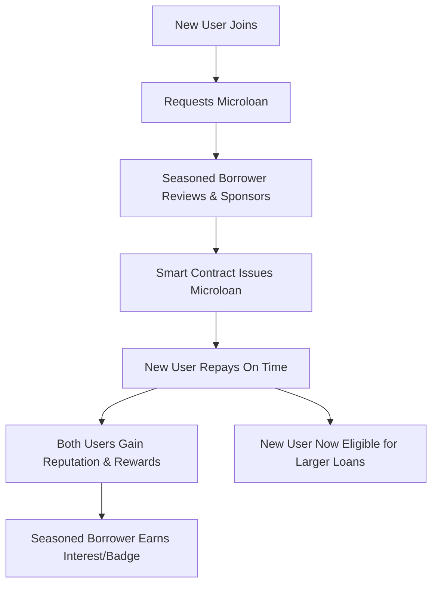

## Incentivizing Seasoned Borrowers: The Microloan Mentorship Program

### **How It Works**

1. **Seasoned Borrowers as Microloan Sponsors**
   - Users with a strong repayment history (high reputation) can allocate a portion of their funds to back microloans for newcomers.
   - These microloans are small, low-risk, and designed specifically for users with no established score.

2. **Smart Contract Security**
   - The platform uses smart contracts to manage funds, ensuring the sponsor’s investment is only at risk if the newcomer defaults.
   - Repayment schedules and terms are transparent and enforced by code.

3. **Dual Incentives**
   - **For Sponsors:** Earn a share of the microloan interest, plus receive platform rewards (e.g., tokens, reputation boosts, badges) for successful mentorships.
   - **For Newcomers:** Gain access to their first loan, and upon successful repayment, immediately build a positive reputation.

4. **Reputation Boosts**
   - Both parties receive positive reputation updates for successful microloan cycles.
   - Sponsors who consistently back successful newcomers may unlock special status, badges, or even governance privileges.

5. **Risk Mitigation**
   - The platform can limit the number or total value of microloans a sponsor can back at once, ensuring diversification.
   - Optionally, a portion of platform charity funds can serve as an insurance pool for sponsors.

### **Sample User Flow**

### **UI/UX Suggestions**

- **Mentorship Dashboard:**  
  Seasoned users see a list of newcomers seeking microloans and their basic profiles.
- **Sponsor Badges:**  
  Visual rewards for users who help many newcomers succeed.
- **Progress Tracking:**  
  Both parties can track repayment status and reputation growth in real time.

### **Messaging Example**

> **Support the Next Wave of Borrowers!**  
> As a trusted member of P₃ Lending, you can sponsor microloans for newcomers. Help others build their reputation, earn rewards, and grow our community—securely and transparently.

## **Benefits**

- **Community Growth:** Encourages a positive, supportive culture.
- **Trust Building:** New users get a fair start, while experienced users are rewarded for their trust.
- **Security:** Smart contracts and risk controls protect all parties.
